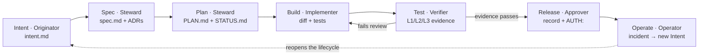
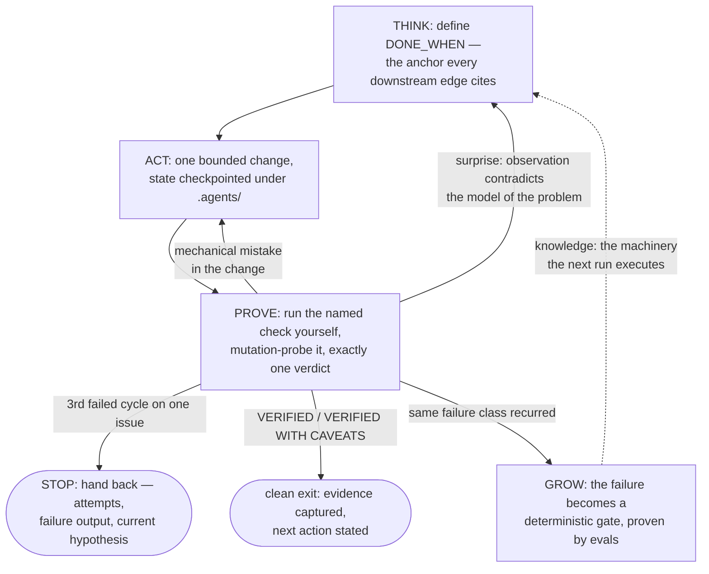

[](https://github.com/bouroo/agents)

[](./LICENSE.md)

# bouroo/agents

A shared setup for autonomous coding agents that is **agnostic of programming languages, agent frameworks, and agent harnesses**: one governance manifesto, eighteen on-demand skills, four routine-task command workflows, and two role agents (orchestrator, worker). Any coding agent that reads repository instruction files can consume it as-is — no installer, no manifests, no per-tool copies.

## The foundation: the delivery lifecycle

The doctrine's spine is the **AI-native delivery lifecycle**. Code stopped being the bottleneck once agents could write it faster than humans could plan, review, and ship around it, so the constraint moved outward — to intent, review, and governance. The job is therefore a **loop, not a phase sequence**: every stage commits a readable artifact the next stage begins from, and the artifact chain is the audit trail.



`Test → Build` is the canonical review back-edge; `Operate → Intent` reopens the lifecycle. Seven **seats** own the stages — one agent may hold several at once, but the Implementer never approves its own work and the Verifier is always independent of what it judges. Within a stage, work is shaped by the **execution graph** (below): the lifecycle says *which stage and what it commits*; the graph says *how that work runs*.

## What's inside

```
├── AGENTS.md                          the manifesto: intake route, decision gates,
│                                      the delivery lifecycle, the execution graph,
│                                      verification dial, context/state, constraints
├── skills/
│   ├── lifecycle/                     the spine: seven stages, their artifacts and
│   │                                  exit checks, the seven seats, handoffs, reopen
│   ├── artifacts/                     the artifact chain: intent / spec / PLAN.md
│   │                                  shapes, WPn packages, DONE_WHEN, STATUS.md
│   ├── evals/                         harness regression suite: realistic tasks as
│   │                                  prompt + objective checks; blocks a merge that
│   │                                  lowers the pass rate
│   ├── craft/                         twelve commandments + PROMPT/INTENT/TWINS/AUTH/
│   │                                  PENDING
│   ├── verification/                  right-sizing dial, evidence as anchors, mutation
│   │   └── references/                probe, judge protocol; flowcharts.md renders the
│   │                                  execution graph as decision charts; evolution.md
│   │                                  the governed GROW cycle
│   ├── graph-engineering/             the execution-graph grammar: nodes, typed edges,
│   │   └── references/                caps, anchors, shapes, cost; worked topologies;
│   │                                  harness design: minimal-harness ladder, ACI
│   ├── teamwork/                      the coordination graph: topology ladder, task
│   │                                  ledger, file ownership, spawn briefs
│   ├── wayfinder/                     efforts too big for one session: map of decision
│   │                                  tickets on the tracker; one ticket per session
│   ├── performance/                   measure-first cycle + overhead-source routing
│   ├── grilling/                      plan-first interview: design tree, frontier
│   │                                  rounds, facts vs decisions
│   ├── solution-architecture/         ASRs + SEI scenarios, pattern selection by
│   │   └── references/                tradeoff, ADRs, C4 modeling, estimation
│   ├── design-pattern-selection/      pain-first GoF selection: no-pattern gate,
│   │   └── references/                shortlist of 2, language reality checks;
│   │                                  condensed 22-pattern catalog
│   ├── domain-modeling/               active domain-language discipline: CONTEXT.md
│   │   └── references/                glossary; ADR trigger triad
│   ├── system-diagramming/            system maps as one interactive HTML: typed JSON
│   │                                  IR, bundled template + validator, no installs
│   ├── confluence/                    operate Atlassian wikis via Rovo or
│   │                                  mcp-atlassian MCP servers
│   ├── modernize-coding/              bring a project's code to current patterns
│   │   └── references/                per-language adapters: go, java, rust,
│   │                                  python, typescript
│   ├── indexed-search/                large-tree search: probe tgrep, index/serve
│   │                                  lifecycle, fallback ladder rg -> Grep
│   └── security-audit/                the candidate gate, calibrated severity,
│       └── references/                needs_validation discipline; attack-class
│                                      coverage and per-domain hunter rules
├── agents/                           role agents: orchestrator (lead) + worker
│   ├── orchestrator.md, worker.md    root links, for omp's plugin-level scan
│   ├── common/                       md + plain.md variants of both
│   └── codex/                        codex toml variants
├── commands/
│   ├── cmd-verify.md                  Test: quality-gate pipeline with fix/re-verify
│   ├── cmd-review.md                  Test: severity-grouped review with one verdict
│   ├── cmd-refactor.md                Build: behavior-preserving restructure, measured
│   └── cmd-document.md                Spec: bootstrap/sync a docs/ tree
├── evals/suite.json                   the harness regression suite (CI-gated)
├── .claude-plugin/, .cursor-plugin/   marketplace plugin + listing metadata
├── .minimax-plugin/                   MiniMax Code plugin metadata
├── gemini-extension.json              extension discovery metadata
└── scripts/
    ├── check.py                       ten deterministic gates (CI runs these)
    └── install.sh                     detect tools on a machine and install
```

## The execution graph

Inside a lifecycle stage, every job runs as an **execution graph**: THINK → ACT → PROVE → GROW are the role-nodes most jobs need, edges are typed and conditional, and every cycle is capped — the forbidden shape is a node re-entering itself with no new evidence. Three graph structures organize anything above trivial: the **task graph** (what: units, dependencies, DONE_WHEN), the **coordination graph** (who: solo → delegation → team), and the **state graph** (how it operates: the repository as system of record). Every proof chain terminates in an **anchor** — a fixed external node like a spec clause, the user's words, or captured command output that the machinery may read but never rewrite; the authority rank (user statement > spec > checks > code) is the anchor ordering. The grammar lives in [graph-engineering](./skills/graph-engineering/SKILL.md); entering at the least agency that closes on evidence — a prompt before a workflow, a workflow before an agent loop — is the [minimal-harness ladder](./skills/graph-engineering/references/harness-design.md).

The loop as a chart — the role-nodes, the surprise back-edges, the hard cap, and GROW's knowledge edge back into the machinery:



The full decision charts — the intake router, each node's internal loop, and the judge protocol — render in [verification/references/flowcharts.md](./skills/verification/references/flowcharts.md).

## The doctrine in one line

Pin the ask in concise English, then classify before working (trivial / fit / shape); owe named gates at decision points (`PROMPT:` `INTENT:` `TWINS:` `AUTH:` `PENDING:`); run every job through the delivery lifecycle, with its stages looping rather than waterfalling; shape each stage's work as an execution graph with typed edges and capped cycles; terminate every proof chain in an anchor; prove with layered evidence (L1 static / L2 runtime / L3 end-to-end), a mutation probe, and a hard verify bound of 3 failed cycles; grow by governed evolution — recurring failures become deterministic gates, the eval suite proves an evolution helped, and controls better models make redundant are cut.

## Using it

Manual consumption only:

- **Manifesto** — copy `AGENTS.md` content into your assistant's instruction file at whatever location your tool reads, or point the tool at this file directly.
- **Skills** — copy or symlink individual `skills/<name>/` directories into the skill path your runtime discovers (they carry standard Agent-Skills frontmatter: `name` + `description`).
- **Commands** — `commands/<name>.md` are self-contained routine-task workflows (verify / review / refactor / document); paste their arguments after invocation wherever your tool surfaces custom prompts, or load them on demand.
- **Role agents** — [agents/common/](./agents/common/) ships two ready-made role agents for the teamwork doctrine: **orchestrator**, the lead (decomposes a complex task into units, dispatches each to a subagent with an executable DONE check, verifies every returned unit itself, owns the merge — never implements a unit), and **worker**, which executes exactly one unit and returns files changed plus evidence. Three ways to activate them:

  - **Installer (recommended)** — `./scripts/install.sh install` places the right variant in each host's agent directory automatically: hosts that accept a `name:` frontmatter key (Claude Code, Gemini CLI, Qwen, pi, omp) get [orchestrator.md](./agents/common/orchestrator.md) and [worker.md](./agents/common/worker.md); hosts that derive the id from the filename (opencode, kilo) get the `.plain.md` no-name variants (orchestrator as `mode: primary`, worker as `mode: subagent`); Codex gets the TOML variants copied into `~/.codex/agents/`. Confirm with `./scripts/install.sh status` — `agents=ok` means both are in place. Hosts without an agents surface (openclaw, hermes, MiniMax) install the manifesto and skills only.
  - **Claude Code plugin** — the marketplace metadata lists both agents, so `/plugin marketplace add bouroo/agents` then `/plugin install coder-agents@bouroo-agents` makes them dispatchable by name.
  - **Manual** — copy or symlink [agents/common/orchestrator.md](./agents/common/orchestrator.md) (or its `.plain.md` variant where the host rejects a `name:` key) into the agent directory your runtime scans.

  Once active, invoke the orchestrator by name through your host's subagent dispatch — a Task/agent tool call, an @mention, or a spawn by name — and it routes implementation units to `worker` when present, else to the host's general-purpose agent.
- **Marketplaces** — the repository ships plugin/extension discovery metadata at its canonical paths (`.claude-plugin/`, `.cursor-plugin/`, `.minimax-plugin/`, `gemini-extension.json`), so Agent-Skills-compatible CLIs can add it directly from GitHub (`npx skills add bouroo/agents`) and host marketplaces consume it without any generation step. omp consumes the same marketplace through its Claude Code-compatible fallback (`/marketplace add bouroo/agents`); its plugin loader takes skills from the manifest path lists and role agents from the repo-root `agents/` directory. MiniMax Code additionally accepts the repository directly as a plugin from a public GitHub repo, since its plugin root is the repository root.
- **Local installer** — `scripts/install.sh` detects which compatible tools live on the machine and links (or copies) the setup into each one's config directory:

  ```bash
  ./scripts/install.sh detect               # what did we find?
  ./scripts/install.sh install              # all detected tools
  ./scripts/install.sh install --dry-run    # preview the exact actions
  ./scripts/install.sh status               # per-tool link state
  ./scripts/install.sh uninstall            # removes only links pointing into this repo
  ```


If a previous major version installed symlinks on your machine, remove them with that version's uninstaller from git history — v4 ships nothing that writes outside this repository.

## Verification

```bash
python3 scripts/check.py --all
```

| Gate | Enforces |
| --- | --- |
| `budget` | `AGENTS.md` stays within its line budget (the concision charter) |
| `frontmatter` | every skill/command carries valid, colon-safe Agent-Skills metadata |
| `links` | every relative Markdown link resolves |
| `agnostic` | core doctrine is free of host-binding tokens |
| `manifests` | marketplace manifests parse; version fields agree across files |
| `privacy` | doctrine is free of real-work identifiers (engagements, spaces, titles) |
| `comments` | the comment rule survives on both canonical surfaces (manifesto + craft) |
| `simplicity` | the simplicity rule survives on both canonical surfaces (manifesto + craft) |
| `modernize` | every `modernize-coding` adapter is present, each version claim is pinned, and the anchored ones (Go, Java) match their toolchain's own local record |
| `evals` | the harness regression suite exists and is well-formed |

CI runs all ten on every push and pull request. Pushing a version tag additionally runs the [release workflow](#versioning).

## Versioning

Git tags are the version source; release notes live in [CHANGELOG.md](./CHANGELOG.md). Pushing a `v<major>.<minor>.<patch>` tag triggers the [release workflow](./.github/workflows/release.yml), which re-runs the gates on the tagged commit and publishes a GitHub Release whose body is the matching CHANGELOG section, read verbatim by `scripts/release_notes.py`. A tag carrying a prerelease suffix (`-beta.1`, `-rc.1`) is published as a **prerelease** and does not become the latest download until a stable tag is cut. Licensed Apache-2.0 ([LICENSE.md](./LICENSE.md)).
