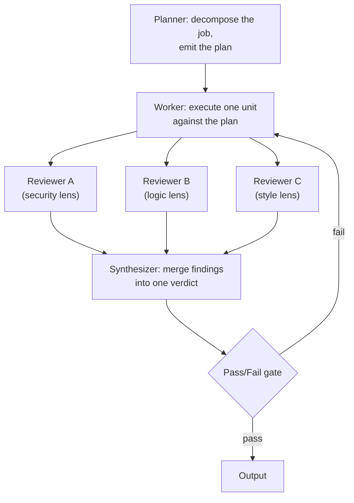

# Workflow Topologies

> Load on demand from [graph-engineering](../SKILL.md): the canonical review graph, worked shapes, and the cost arithmetic behind the keep/drop verdict. Structure is doctrine; numbers are the guides' claims — re-derive them on your own runs before citing any.

## The canonical review graph

The industry's reference shape — five nodes, every edge conditioned, and the fail edge the whole point:

Read it in the grammar's edge vocabulary: `PRODUCES` from planner to worker, `FAN_OUT` to the three lens reviews, `JOINS` at the synthesizer, `ROUTES` at the gate — pass exits, fail `RETURNS` to the worker carrying the merged findings (the payload, not a flag) and counting against the cap. The review lenses fan out concurrently and rejoin at the synthesizer; the `RETURNS` edge is the whole feedback loop, so its payload and its cap are design decisions, not afterthoughts.

## Edge conditions

Every edge answers one question: what happens on failure, and where does it go?

| Condition | Route | Notes |
| --- | --- | --- |
| Reviewer fails, blocking | `RETURNS` to the Worker with the findings | the worker needs the delta, not just the flag |
| Reviewer fails, non-blocking | flag to the Synthesizer | the verdict carries the caveat forward |
| Gate fails after rework | step down the shape ladder | the concurrency did not pay |
| Gate passes | done | evidence per the verification standard |

A gate that routes back more than its cap times is an unbounded loop wearing a graph costume — verification's caps (3 failed cycles) bind here too.

## The four shapes, worked

| Shape | Looks like | Cost profile |
| --- | --- | --- |
| linear | typo fix: THINK (find the line) -> ACT (fix) -> PROVE (L1) | baseline |
| staged | refactor with checkpoints: baseline -> atomic steps -> re-verify per stage | + checkpoints |
| fan-out | migrate 40 files: one worker per file, `JOINS` at the report | + workers, linear in files |
| graph | multi-lens review of a critical change: parallel reviewers, synthesis, gated `RETURNS` | + reviewers per cycle; wins only above the breakeven |

## The cost arithmetic

The guide's model, as a re-derivable calculation rather than a fact:

- A sequential shape passing with per-cycle probability p spends, in expectation, 1/p cycles.
- A parallel graph spends the same 1/p review cycles, but its reviews run concurrently — the wall-clock win — while each cycle pays every reviewer at once.
- The graph's premium is therefore (number of reviewers) x (failure probability), which puts the claimed breakeven near p = 0.5: above it, concurrency repays; at p = 0.3 the guide prices the graph at ~3x tokens for the same result.

Re-derive on the job's own pass rates. Track **cost per successful completion** (total tokens and wall-clock divided by completed jobs), never wall-clock alone. Price the all-reviewers-fail path explicitly — reviewers that correlate (same lens, same blind spot) fail together, and correlated failures are what turn the premium into a tax.

## Temporal validity

Auto-derived graphs decay: the guide's illustration prices 85% per-hop entity resolution at ~44% trustworthiness over five hops (0.85^5). Human-authored edges sidestep the compounding, but not expiry: knowledge edges (`SUPERSEDES`, `DEPENDS_ON`, ...) carry creation and last-verification dates — facts expire, they do not die — and an undated edge is stale until proven current.

## Cross-references

- [graph-engineering](../SKILL.md) the grammar this file works out.
- [verification](../../verification/SKILL.md) the evidence standard at the gate; the caps that bound every route back.
