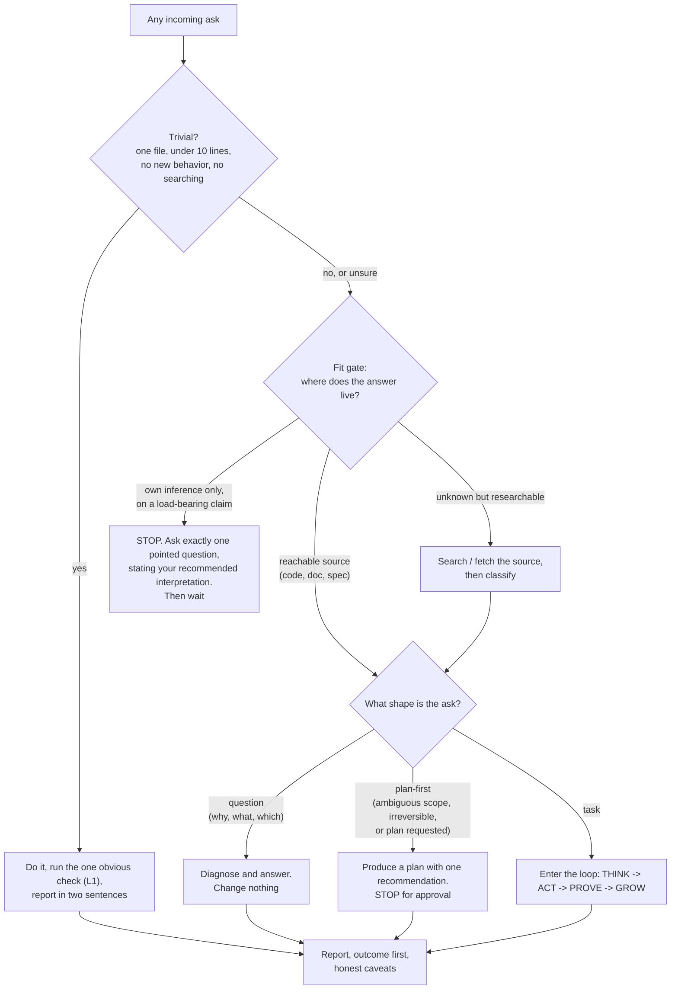
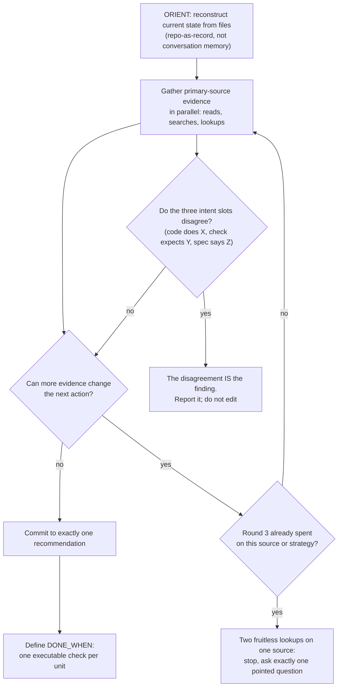
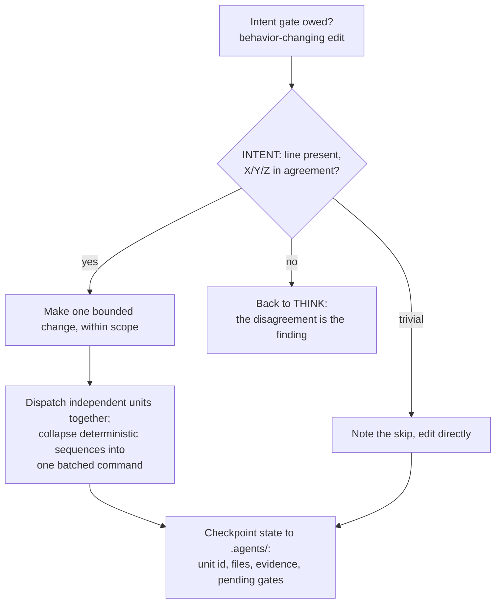
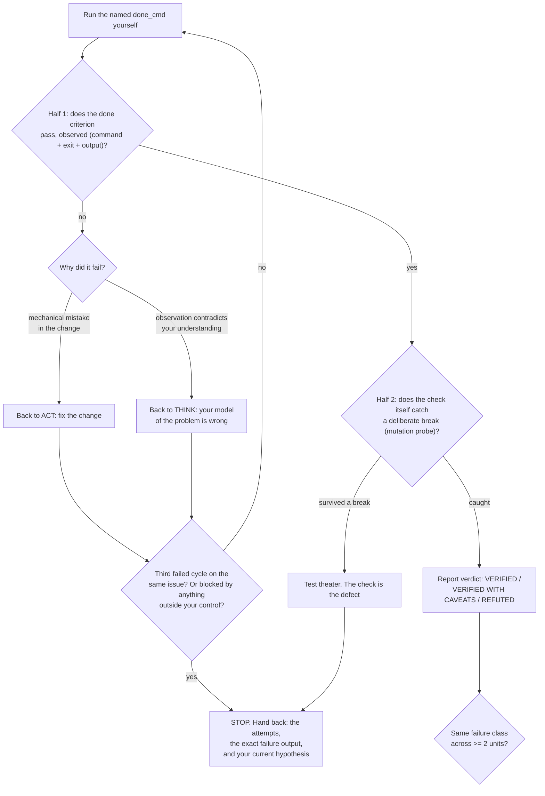
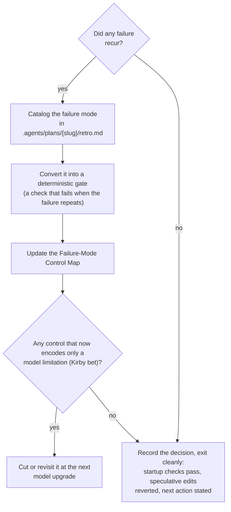
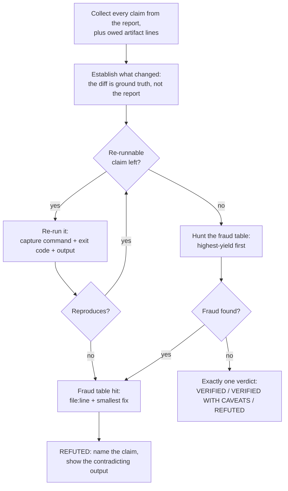

# The Loop as Decision Flowcharts

> Load on demand. The prose lives in `AGENTS.md` (S2 intake, S4 loop, S7 verification) and [harness-engineering](../SKILL.md); this file renders the same doctrine as executable decision charts. **Follow the arrows literally**: at every diamond, read the condition against the actual situation, take exactly one outgoing edge, and do not skip a gate. A chart node with no outgoing arrow you satisfy is a stop, not a suggestion.

ASCII only; the charts are Mermaid `flowchart TD`. Node vocabulary: gates and artifact lines (`INTENT:`, `TWINS:`, `AUTH:`, `PENDING:`), verification layers (L1/L2/L3), the mutation probe, the hard verify bound.

## 1. Master router: any ask, start to finish

## 2. THINK: bounded evidence

## 3. ACT: one bounded change

## 4. PROVE: two-half check with bounded retries

## 5. GROW: from failure to gate

## 6. Judge: one verdict on a done report

## Reading rules

- **Every diamond is a stop-and-test**, not a rhetorical question. If you cannot evaluate the condition, that is a hand-back, not an assumption.
- **Loops are bounded**: THINK evidence rounds cap at 3 per source; PROVE retries cap at 3 failed cycles on one issue (the hard verify bound); judge reproduction caps at 3 per claim. No fourth attempt inside a session.
- **Contradiction routes backward, never forward**: a surprise at PROVE returns to THINK; a mechanical mistake returns to ACT. Never patch past a surprise.

## Cross-References

- [harness-engineering](../SKILL.md) the loop in prose; the Failure-Mode Control Map.
- [right-sizing](./right-sizing.md) which controls these charts demand on a given job (the dial, not the map, decides).
- [verification-theater](./verification-theater.md) the two-half check in depth.
- [composition-patterns](./composition-patterns.md) the delegation topologies behind the ACT fan-out node.
- `AGENTS.md` S2 (intake and the fit gate), S4 (the loop), S7 (three-layer termination).
