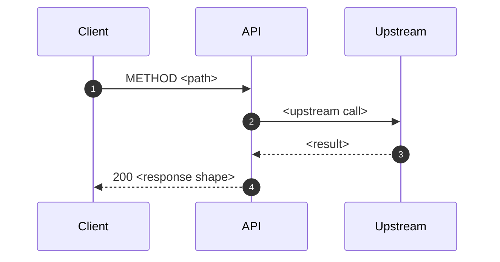

# <Service> - <METHOD> <path>

> **One endpoint per file** at `docs/api/<service>/<method>-<path>.md` (e.g.
> `docs/api/cart/POST-v1-cart-get.md`). This is the human/agent-readable contract
> for a single endpoint. It is complementary to, not a replacement for, the
> machine-readable OpenAPI contract (`docs/openapi.yaml`) -- if the OpenAPI spec
> already fully specifies the endpoint, a separate API doc may be unnecessary.

## Metadata

| Field | Value |
|---|---|
| Service | <service name> |
| Method | GET / POST / PUT / PATCH / DELETE |
| Path | /api/v1/<resource>/<id> |
| Auth | <scheme: bearer / session / api-key / none> |
| Produces | application/json |
| Stability | <experimental / ga / deprecated> |

## Overview

What this endpoint does, in one or two sentences, and who calls it.

## Sequence



## Request

Parameters:

| Name | In | Type | Required | Description |
|---|---|---|---|---|
| id | path | string (uuid) | yes | resource identifier |
| type | query | enum(a, b) | no | filter |

Body fields (if any):

| Field | Type | Required | Description | Notes |
|---|---|---|---|---|
| content.id | string | yes | resource identifier | |

Sample request:

```json
{ "content": { "id": "50d80b8b-..." } }
```

## Response

Status codes:

| HTTP | Code | Meaning | When |
|---|---|---|---|
| 200 | 0000 | success | resource found |
| 409 | AIS4091 | business error | upstream rejected |
| 422 | AIS4001 | validation error | required field missing |

Success body fields:

| Field | Type | Description |
|---|---|---|
| content.resultCode | string | upstream result code |
| content.data | object | full resource, verbatim |

Sample success (200):

```json
{ "headerResp": { "statusCd": "0000" }, "content": { "resultCode": "20000", "data": {} } }
```

Sample error (409):

```json
{ "headerResp": { "statusCd": "AIS4091", "statusDesc": "upstream business error: ..." } }
```

## Error handling

The error envelope, the meaning of each non-2xx code, and whether errors are retried, surfaced to the caller, or mapped to a different status.

## Source map

Relative Markdown links to the route/handler, the request/response DTOs, and the upstream client integration.

## Related docs

Links to the system doc that owns this endpoint, related flows, ADRs, glossary terms, the OpenAPI contract, or sibling endpoint docs.
